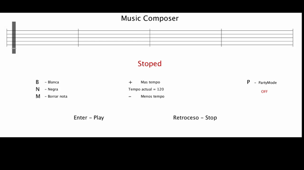

# CIU-7-Sonido

### Autor: Víctor Herrera Delgado
Estudiante de Ingeniería Informática en la Universidad de Las Palmas de Gran Canaria, en último curso de su grado.

## Introducción 
La práctica en cuestión consiste en dados los conocimientos explicados en clase, proponer un concepto que además de las herramientas gráficas utilizadas anteriormente, use síntesis de sonido. En este caso con el proposito de experimentar con la librería soundcipher, se ha realizado un pentagrama interactivo en el cual el usuario pueda escibir una pequeña melodía y reproducirla. 

## Programa

## Instrucciones

## Decisiones
Si bien es verdad que la práctica no realiza mucha edición de sonido, el autor no le veía mucha más utilidad que entretenimiento a estas herramientas. Dado que el autor no tiene conocimientos musicales aun queriendo intentar componer algo pequeño, las herramientas encontradas (como MuseScore) eran para gente con conocimiento en música, así que se buscó desarrollar una aplicación sencilla que permitiera componer pequeñas melodías, a pesar de la posible simpleza de esto.

Se intentó implementar visualización gráfica a partir de lo aprendido con la librería minim, sin embargo era poco satisfactoria la forma en la que se implementaba con processing.

## Funcionamiento
El gif no muestra el verdadero rendimiento de la aplicación.  

## Referencias

Programa usado para comprobar los tonos musicales:  
https://play.google.com/store/apps/details?id=com.tadaoyamaoka.vocalpitchmonitor&hl=en

Conversor de video a gif  
https://hnet.com/video-to-gif/

Grabación del programa  
https://obsproject.com/

